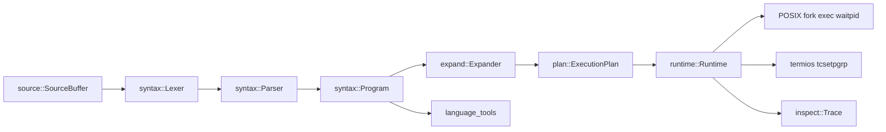

# Architecture

Splice keeps five observable boundaries separate. `source` owns immutable bytes and half-open spans. `syntax` preserves quote and expansion provenance in tokens and AST nodes. `expand` turns a parsed word into fields under an explicit shell state. `plan` validates ordered descriptor actions before launch. `runtime` owns every child status, process group, terminal handoff, and cleanup event in one event loop.

The application layer is intentionally thin. It selects a profile, reads a script or terminal input, asks syntax tools for diagnostics when requested, and passes executable work to the same runtime used by interactive commands. No external shell is an execution backend.

## Ownership invariants

1. A `source::Span` never outlives its `SourceBuffer`.
2. A child PID is registered before an unblocked SIGCHLD can be observed by the owning loop.
3. Each owned waitable PID is collected by exactly one status owner.
4. Descriptor operations are ordered data, not an unordered map.
5. The shell restores descriptors and terminal attributes on every parent-side builtin path, including errors.

The detailed contracts are being added with each implementation increment. See the ADRs for the single-owner event-loop choice and the platform boundary.
